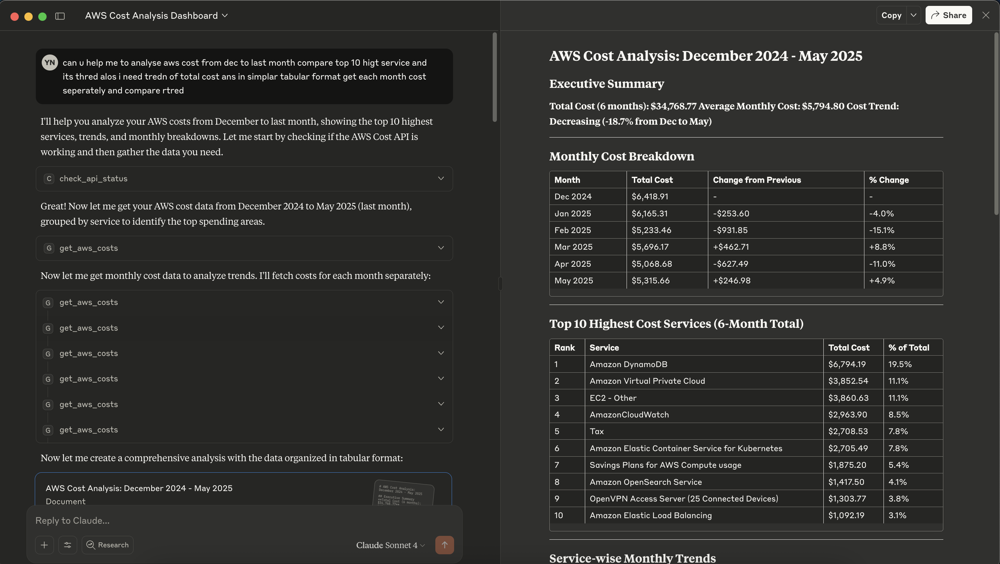

# AWS Cost Analysis Backend

Backend API service for AWS cost analysis using FastAPI and AWS Cost Explorer.

## Result 



## Setup

1. Create virtual environment:
```bash
python -m venv venv
source venv/bin/activate  # On Windows: venv\Scripts\activate
```

2. Install dependencies:
```bash
pip install -r requirements.txt
```

3. Configure environment:
```bash
cp .env.example .env
# Edit .env with your AWS credentials
```

4. Run the server:
```bash
uvicorn aws.main:app --reload --port 3001
```

## API Endpoints

- `POST /api/v1/costs/summary` - Get cost summary for date range
- `GET /health` - Health check endpoint

## Testing

```bash
pytest
```
